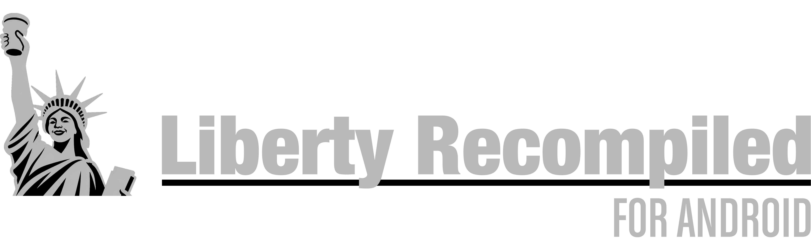
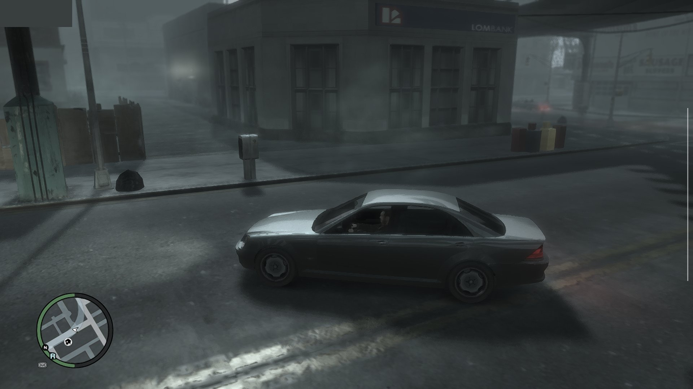
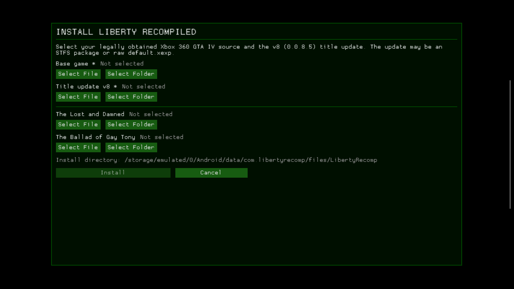

    

# LibertyRecompAndroid

An Android port of [Liberty Recompiled](https://github.com/OZORDI/LibertyRecomp), the static
recompilation of the Xbox 360 version of Grand Theft Auto IV. It runs the recompiled game natively
on arm64 Android phones and handhelds with a Snapdragon (Adreno) GPU, using Vulkan through a bundled
Mesa Turnip driver. There is no emulator in between.

    

**DISCLAIMER!**

This is pure 100% AI slop. I didn't made this by hand at all, it's all thanks to Claude and I, vaduur, take ZERO credit or responsibility of this port being unstable. It will run shitty, that's a guarantee. All I did is spent couple of sleepless night testing and pointing out the issues. Oh, yeah, and spent some pocket change on Claude sub ofc. Please be aware of it and feel free to fork this repo or use it as a reference in your future ReXGlue to Android ports. Thank you and have a nice day.

BTW, Any feedback is very appreciated, [Issues](https://github.com/vaduur/LibertyRecompAndroid/issues) are open, submit a ticket if you have any.

> [!CAUTION]
> This is an experimental, unofficial port of a project that is itself in early development.
> Expect crashes and rough edges. It has been developed and tested on **one device**, a
> Retroid Pocket 5 (Snapdragon 865 / Adreno 650).

**This project does not include any game assets.** You need your own legally obtained copy of the
Xbox 360 game and its title update. Nothing here helps you get them.

## Status

On the Retroid Pocket 5 with the default settings:

- The game installs, boots and plays: the intro, the early story missions, free roam and driving
  have been played. Saves persist across launches.
- The game renders at the console's native 720p with FXAA. The display scales the image to the panel.
- Frame rate is capped at 30 FPS with VSync. Most places hold a steady 30. The heaviest far views
  (bridges, the skyline at night) drop to about 25–29 FPS.
- Shadows, draw distance and the shadow map size match the console. Traffic and pedestrian density
  are reduced to 40% of the PC defaults to save CPU time.
- Audio works, including the radio, cutscenes and Bink videos.

Known problems:

- Occasional crashes to the home screen still happen. Save often.
- The installer's **Select File / Select Folder** buttons do not work on Android: the system file
  picker returns `content://` links the installer cannot read. Copy the files into the app's
  `install` folder instead (see [INSTALL.md](docs/android/INSTALL.md)).
- One deferred light-volume shader is skipped, because it hangs the GPU under Turnip. A few
  light volumes are missing as a result.
- The episodes (The Lost and Damned, The Ballad of Gay Tony) and online multiplayer have not been
  tested on Android.
- The on-screen touch controls have not been tested on Android (see [Controls](#controls)).

## Device requirements

| | Requirement |
|---|---|
| **GPU** | **Qualcomm Adreno 6xx or 7xx** (Snapdragon). Tested on the Adreno 650 only. |
| **SoC** | Snapdragon 865 class or faster recommended (SD 865/870/888, 8 Gen 1/2/3, 8s Gen 3, …). |
| **CPU** | arm64 with ARMv8.2-A (the build uses LSE atomics). ARMv8.0 chips such as the Snapdragon 835 crash on start. |
| **Android** | Android 10 (API 29) or newer, 64-bit. |
| **RAM** | 8 GB recommended. 6 GB is untested. |
| **Storage** | About 7 GB for the installed game, plus room for the disc image while installing (about 15 GB free in total). |
| **Controller** | An XInput (Xbox-layout) gamepad is strongly recommended, see [Controls](#controls). |

**Not supported:**

- **ARM Mali / Immortalis GPUs.** This covers most Exynos chips before the 2200, MediaTek
  Dimensity/Helio and Google Tensor.
- **Samsung Xclipse GPUs** (Exynos 2200 and newer).
- **PowerVR GPUs** and anything else that is not an Adreno.

Why only Adreno: the renderer needs Vulkan 1.2 and was tuned on Turnip. Turnip is Mesa's open-source
Vulkan driver, and it exists only for Adreno GPUs. The stock Qualcomm driver on older devices
(including the Adreno 650) exposes only Vulkan 1.1. On other GPUs the bundled driver cannot load,
and nobody has run the renderer on their vendor drivers.

**Adreno 8xx** (Snapdragon 8 Elite) is not supported by the bundled Turnip build. It *might* work
with the system driver or a newer Turnip build (see [ADVANCED.md](docs/android/ADVANCED.md#driver-selection-drivertxt)),
but this is untested. Low-end Adreno 6xx parts (610/618/619) should start, but expect them to be
far too slow.

## Controls

**An XInput (Xbox-layout) gamepad is strongly recommended.** For example:

- an Xbox controller over Bluetooth or USB;
- any XInput-compatible pad;
- the built-in controls of a gaming handheld (Retroid, AYN Odin, AYANEO and similar) in Xbox
  mode.

The game is the Xbox 360 version, so its controls and button prompts follow the Xbox layout one to
one. Other controllers that Android recognizes (DualShock, DualSense, Switch Pro and so on) usually
work through SDL. Their buttons are mapped by position, though, and they have seen much less
testing.

**On-screen touch controls: present, but untested on Android.** Upstream Liberty Recompiled has a
context-sensitive touch overlay whose buttons change between on foot, driving, the phone and so on.
In its default `auto` mode, the overlay appears only when **no** gamepad, keyboard or mouse is
connected. Every handheld this port was developed on has a built-in gamepad, so the overlay has
never been shown or tuned on Android. On a phone without a controller it should appear on its own.
Expect rough edges, and treat it as a fallback rather than a way to play the game. Control it with
`--touch_controls=auto|on|off` in `args.txt` (see [ADVANCED.md](docs/android/ADVANCED.md)) or with
the touch controls option in the game's settings menu.

## Game files required

- The **Xbox 360 GTA IV disc** as an `.iso` image. Only the **USA (NTSC-U)** release has been
  verified.
- **Title Update 8** for that release (version **0.0.8.5**), either as the STFS package or as a raw
  `default.xexp`. The PAL title update (0.0.8.6) is rejected.

The port was developed and tested with these exact files:

| File | Size | MD5 | SHA-1 |
|---|---|---|---|
| `Grand Theft Auto IV (USA) (En,Fr,De,Es,It).iso` (full disc image) | 7,835,492,352 bytes | `f0a046aed1520a913b2125f0a69ee7d0` | `caa48dfb3b1b2fe3131e61fc66e35a22c6d0ba13` |
| `TU_1A581VI_000000K000000.0000000000205` (Title Update 8, STFS package) | 3,715,072 bytes | `f041b5f6721d7ee578560bac21668826` | `88d1c438814298b6da987b3ad5edc7e48a769ac9` |

If your files match, they are known to work. Other dumps of the same USA disc (for example
trimmed or extracted images) may work too, but they have not been tested. Check your files with
`certutil -hashfile <file> MD5` on Windows, or `md5sum <file>` on Linux and macOS.

See the upstream [dumping guide](docs/DUMPING-en.md) for how to get these files from your own
console and disc.

## Quick start

1. Install `LibertyRecompAndroid-*.apk` from the [Releases](../../releases) page, launch it once, then close it.
2. Copy your disc image (`*.iso`) and the Title Update 8 file into
   `Android/data/com.libertyrecomp/files/install/`. A PC over USB is the easiest way.
3. Launch the app again. The installer picks up both files and installs the game by itself.

This is the installer screen on the first launch:

Do not use its **Select File / Select Folder** buttons: they cannot read files picked through the
Android file picker. The full walkthrough is in [INSTALL.md](docs/android/INSTALL.md).

## Documentation

| Document | Contents |
|---|---|
| [Installation and first launch](docs/android/INSTALL.md) | Installing the APK, copying the game files, the first-run installer, upgrading |
| [Advanced configuration](docs/android/ADVANCED.md) | `args.txt` settings, live tuning, driver selection, logs, performance presets |
| [What was done for Android](docs/android/PORTING.md) | Technical write-up of the port: build, platform layer, driver, renderer and stability work |
| [Building from source](docs/android/BUILDING.md) | Building the APK yourself |
| [Upstream README](README_UPSTREAM.md) | The original Liberty Recompiled README (desktop builds, mods, online) |

## Credits

- [Liberty Recompiled](https://github.com/OZORDI/LibertyRecomp) by OZORDI and contributors, and the
  [ReXGlue SDK](https://github.com/rexglue/rexglue-sdk) it is built on. Almost all of the hard work
  of recompiling GTA IV is theirs. This fork adds the Android platform layer and the Android
  performance work.
- [Mesa Turnip](https://docs.mesa3d.org/drivers/freedreno.html), the open-source Adreno Vulkan driver.
  The bundled build is StevenMXZ's Turnip 26.3.0-R6.
- [libadrenotools](https://github.com/bylaws/libadrenotools) by bylaws, which loads a custom driver
  into an app.
- The Vulkan driver proxy comes from [skate3-android](https://github.com/andrewnakas/skate3-android)
  and [skate3-pocket](https://github.com/AlanConstantino/skate3-pocket).
- [SDL3](https://github.com/libsdl-org/SDL) for the Android activity, input and audio.
- [nfsmw-nx](https://github.com/StevensND/nfsmw-nx) by StevensND, a ReXGlue port of Need for Speed:
  Most Wanted to the Nintendo Switch and a great reference for running a ReXGlue recompilation on
  weak hardware. Our direct-calls tool (`gta4-recomp/tools/direct_calls.py`) is adapted from their
  `llamadas_directas.py`. Their work on game busy-waits and thread placement led to this port's
  frame-wait hook and thread pinning experiments.

Grand Theft Auto IV is a trademark of Take-Two Interactive Software. This project is not affiliated
with or endorsed by Rockstar Games or Take-Two Interactive.
