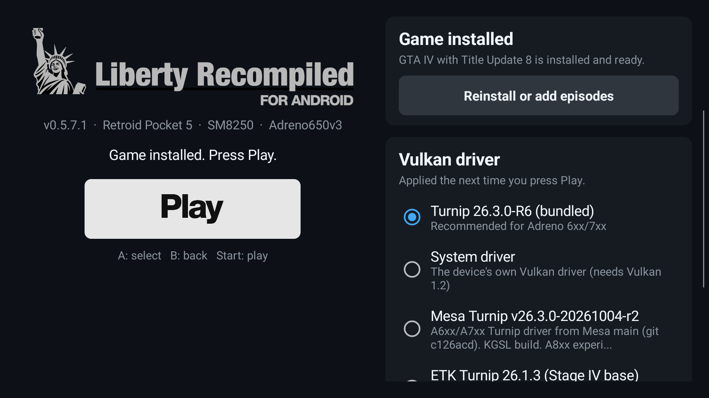
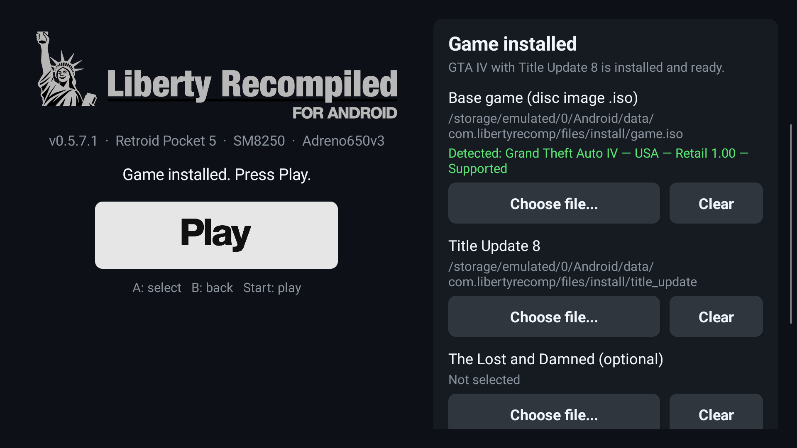
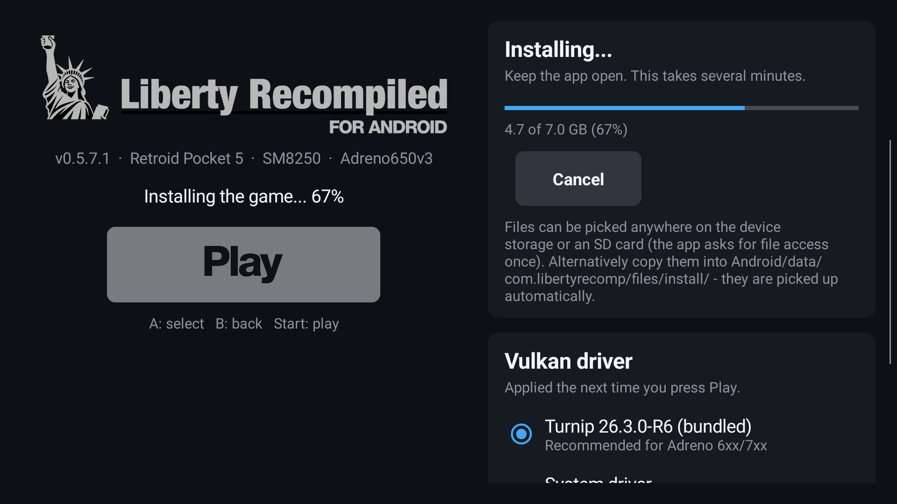

# Installation and first launch

Before you start, check that your device meets the [requirements](../../README.md#device-requirements):
an Adreno 6xx/7xx GPU, Android 10+, about 15 GB free, and a controller.

You need two files from your own copy of the game:

| File | What it is |
|---|---|
| `something.iso` | The GTA IV Xbox 360 disc image (USA release, about 7.8 GB). |
| Title update 8 | Version 0.0.8.5 for the USA release, either the STFS package (a file with a long hexadecimal name) or a raw `default.xexp`. |

The MD5 and SHA-1 hashes of the tested files are listed in the
[README](../../README.md#game-files-required).

## 1. Install the APK

1. Download the latest `LibertyRecompAndroid-*.apk` from the [Releases](../../../../releases) page.
2. Open it on the device and allow installing from this source when Android asks.
3. The app appears as **Liberty Recompiled** (package `com.libertyrecomp`).

## 2. Open the app: the launcher



The app always opens on the launcher (0.5.6.3 and newer):

- **Left:** the game status and **Play**. Play stays grey until the game is installed.
- **Right, Game:** installing the game, the title update and the episodes (0.5.7 and newer).
- **Right, Vulkan driver:** the driver choice, see [below](#the-vulkan-driver).

Gamepad: the D-pad moves between the controls, **A** selects, **B** closes the app and **Start**
plays.

## 3. Install the game from the launcher (0.5.7 and newer)



1. Under **Base game**, press **Choose file...** and pick your disc image (`.iso`). The first time,
   the app asks for **All files access**. Android opens the setting; turn it on and come back. With
   it, the files can stay anywhere on the device storage or an SD card: in Download, a games
   folder, wherever. Nothing has to be copied first.
2. The disc image is checked right away. A green line, such as *Detected: Grand Theft Auto IV — USA
   — Retail 1.00 — Supported*, means it is the right disc. A red line says what is wrong (for
   example, another region).
3. Under **Title Update 8**, choose the title update (the STFS package or a raw `default.xexp`).
4. Optionally choose **The Lost and Damned** and **The Ballad of Gay Tony**.
5. Press **Install**. The progress is shown in the panel and on the left.



Keep the app open until it finishes. On the Retroid Pocket 5 the whole installation took under a
minute. Slower storage or an SD card can take several minutes. When it is done, Play turns white:
press it.

The game is installed into `Android/data/com.libertyrecomp/files/LibertyRecomp/game` (about
6.5 GB). The disc image and the title update are only read, so you can delete them afterwards.

**Without All files access.** Copy the two files into
`Android/data/com.libertyrecomp/files/install/` instead, as described in the next section. The
launcher fills them in by itself.

**Episodes later.** Once the game is installed, the panel shows **Reinstall or add episodes**.
Choose only the episode files and press **Install episodes**.

## 4. Alternative: the `install/` folder

This is the only way on versions older than 0.5.7, and it still works on all versions. It needs
no permission.

The app keeps everything in its own external data folder:

```
Internal storage/Android/data/com.libertyrecomp/files/
├── install/          <- the disc image and the title update can go here
├── LibertyRecomp/
│   ├── game/         the installed game (about 6.5 GB)
│   ├── saves/        your save games
│   └── shader_cache/
├── args.txt          settings, see ADVANCED.md
└── ...
```

Start the app once so that the folder exists. Then copy into
`Android/data/com.libertyrecomp/files/install/`:

- the disc image, which must end in `.iso`;
- the title update file under any other name. If several non-`.iso` files are there, the largest one
  is used.

Ways to copy:

- **From a PC over USB (easiest).** Connect the device in file transfer (MTP) mode. Open
  `Internal storage > Android > data > com.libertyrecomp > files > install` and copy the two files in.
- **With adb:**
  ```
  adb push GTAIV.iso /sdcard/Android/data/com.libertyrecomp/files/install/game.iso
  adb push <title-update-file> /sdcard/Android/data/com.libertyrecomp/files/install/title_update
  ```
- **On the device.** Since Android 11, most file managers cannot write into `Android/data`. Some
  can with extra setup, for example through Shizuku. If yours cannot, use a PC.

On 0.5.7 and newer, the launcher fills these files into the Game panel; press **Install**. On
older versions, press **Play**, or just start the app on versions before 0.5.6.3. The game's own
installer then picks the files up and installs by itself:


> [!NOTE]
> The **Select File / Select Folder** buttons of the in-game installer do not work on Android: the
> system file picker returns `content://` links, which that installer cannot read. Use the
> launcher (0.5.7+) or the `install/` folder.

## The Vulkan driver

Choose the bundled Turnip (default), the device's own driver, or a driver you imported.
**Import driver (.zip)** opens the system file picker. Pick an AdrenoTools/Turnip driver zip (a
`.so` and usually a `meta.json`), and it is unpacked, added to the list and selected. **Remove**
deletes an imported driver. The choice is saved in `driver.txt` (see
[ADVANCED.md](ADVANCED.md#driver-selection-drivertxt)). Play always starts a fresh game process
with the selected driver. If you leave the game with the Home button, the app icon takes you back
to the running game, not to the launcher.

## 5. After the installation

- **Free the space.** Once the game runs, you can delete the disc image and the title update
  (wherever they are, `install/` included). That gives back about 7.8 GB, and they are not needed
  again.
- **The first minutes are slower.** Shaders are compiled the first time they are needed, so you
  will see some hitches. They are cached in `shader_cache/` and stay smooth on later runs.
- **Controls.** An XInput (Xbox-layout) gamepad is strongly recommended: the built-in controls
  of a handheld, or an Xbox controller over Bluetooth or USB. Without a controller, an on-screen
  Xbox gamepad appears instead (see [Controls](../../README.md#controls)).

## Upgrading to a newer version

Install the new APK over the old one. The game, saves and settings are kept.

`args.txt` is copied from the APK's defaults **only when it does not exist**. Your old `args.txt`
keeps overriding whatever the new version changed. To get the new defaults, delete
`Android/data/com.libertyrecomp/files/args.txt` before launching the new version. If you had
custom settings, apply them again afterwards.

If Android refuses to install over the old version (a signature mismatch between builds from
different machines), uninstall it first. **Back up `LibertyRecomp/saves/` before you do:**
uninstalling an app deletes its `Android/data` folder, which contains the installed game and your
saves.

## Troubleshooting

| Symptom | What to check |
|---|---|
| A dialog says no usable Vulkan driver / Vulkan 1.2 is needed | The GPU is not supported, see the [requirements](../../README.md#device-requirements). If you created `driver.txt`, delete it. Details are in `files/last_launch.txt`. |
| The app closes right after launch, without a dialog | An ARMv8.0 CPU (see the [requirements](../../README.md#device-requirements)) or an invalid line in `args.txt`. Deleting `args.txt` restores the defaults. Check `files/last_launch.txt`. |
| The installer shows **Not selected** | The files are not directly inside `files/install/`, or the disc image does not end in `.iso`. |
| The installer rejects the title update | It must be TU8 for the **USA** release (0.0.8.5). The PAL update (0.0.8.6) is not accepted. |
| Black screen or a crash after changing settings | Delete `args.txt` (defaults come back) and `live_cvars.txt` if you used it. |
| Something else | Collect a log as described in [ADVANCED.md](ADVANCED.md#logs) and open an issue on the [Issues](https://github.com/vaduur/LibertyRecompAndroid/issues) page. |

Questions, bugs and feedback all go to [Issues](https://github.com/vaduur/LibertyRecompAndroid/issues). Mention your device, the Android version and the port version.

### Collecting information without a PC

- **`files/last_launch.txt`** is written at every start. It holds the device, the chip, the GPU,
  the Android version and which Vulkan driver was used, or why none could be. Attach it to your
  issue.
- **The newest file in `files/Liberty Recompiled/logs/`** is the game's own log.
- **A full system log** (the same thing `adb logcat` gives) without a PC: enable Developer options
  (tap *Build number* seven times in *About phone*), then choose *Developer options > Take bug
  report*. Share the resulting zip.
- **The GPU and its Vulkan version:** the free *Vulkan Caps Viewer* or *AIDA64* apps show them.
